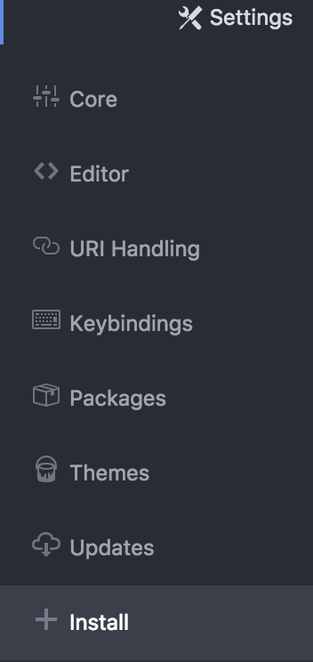
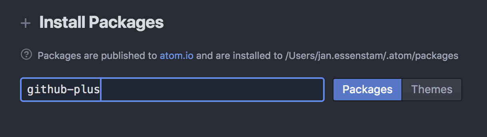
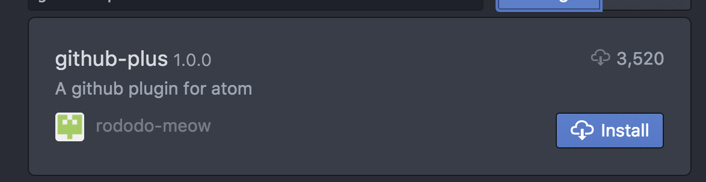
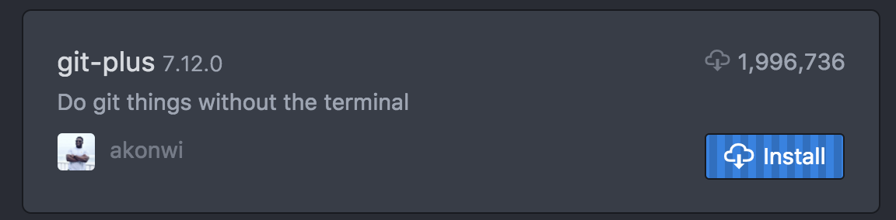

.. _atom_install:

-----------------
Atom Installation
-----------------

Goto https://atom.io/. The webpage will show you the version that is supported for your O/S.
Download and install the software package by following the screen and wizards you might encounter.
For an example for installting Atom on Windows 10, follwing this video: https://www.youtube.com/watch?v=nshxC0YO_X0

Initial Configuration
+++++++++++++++++++++

After the installation start Atom and change the preferences.

1. Go to **+ Install** and type in the "search bar" github-plus

Click on the **Packges** button and the below screen should be shown for the github-plus packes.

Click on the **Install** button to have the package installed.

Also have a look at this YouTube video to get some idea on what you have done just now: https://www.youtube.com/watch?v=TzKi6ZZtIAo.

Repeat these steps for the foloowing extra packages

1. Git-plus

Also have a look at the YouTube video: https://www.youtube.com/watch?v=7Id1_VfbEKo to have some more idea on git commands directly from the Atom interface.

2. Language-sphinx

After the installation of the packages, on the righthand corner, extra possible actions (like a restart of Atom) will be shown.

You can now start using the Atom and have the colour syntaxing for **.rst** file available for the Sphinx Language. This language is what we use to “dynamically” have webpages created on http://www.nutanixworkshops.com.
