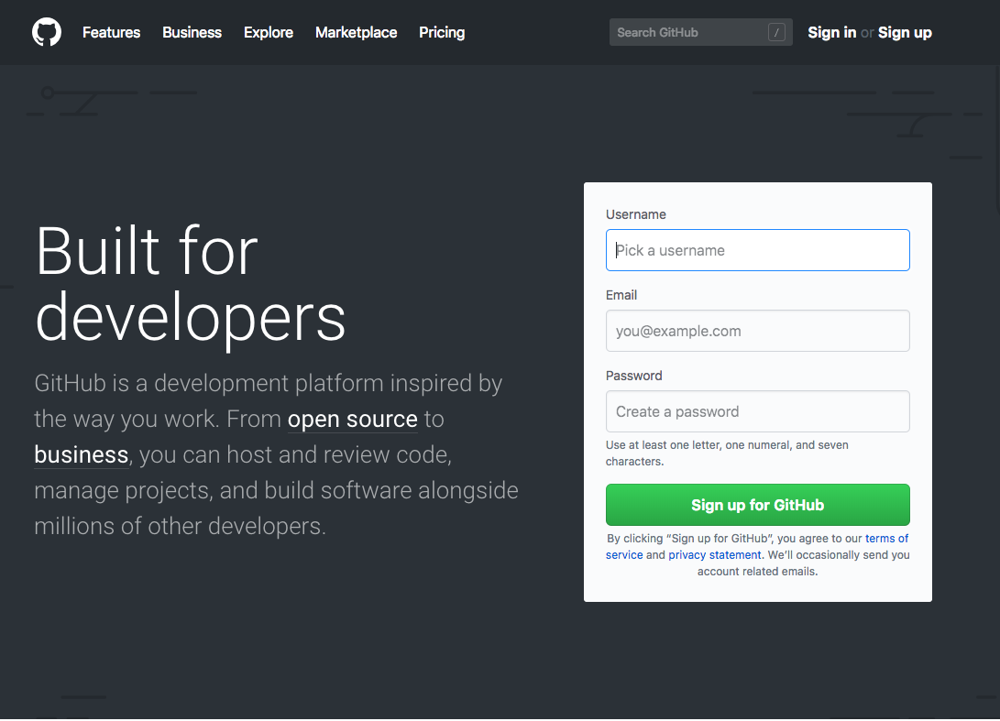

.. _pre_reqs:

--------
Overview
--------

To have the installation ready to create a workshop, you need to have the following pre-requirements ready:

1. Installation of Pyhton compiler
2. Installtion of git application
3. a GitHub account for pulling and pulling data

Installing python compiler
++++++++++++++++++++++++++

As the installation is dependent on the O/S and very well documented, you can use google as a staring point to search. MacOS and most Linux distribution has Python installed by default. Only Windows need to have Python installed in a separate way.
An example of the installation could be: https://github.com/BurntSushi/nfldb/wiki/Python-&-pip-Windows-installation

Install the git application
+++++++++++++++++++++++++++

As the installation is dependent on the O/S and very well documented, you can use google as a staring point to search. An example of installation for the O/S of choice can be found here https://www.atlassian.com/git/tutorials/install-git. 

Create a GitHub account
+++++++++++++++++++++++

As the information will be stored on the GitHub cloud you need to have an account so you and the Technical Enablement Team can see who has uploaded and changed what.

Go to https://github.com and create an account.

