.. _atom_conf:

-------------
Usage of Atom
-------------

This part of the document is how to use Atom to create documentation/workshops. The steps to be taken are:

#. Clone the templates from the GitHub organisation page using **git** command line

#. Open Atom and create the document

#. Save the document locally

#. Build the document so you can see the outcome and how the page look like

#. Commit the changes locally

#. Push the data to the personal GitHub location

#. Use git pull request to upload the data into the organisational GitHub location

Clone the templates
+++++++++++++++++++

Create a directory (project) in a location of choice on your machine. The next step is dependent on the way you want to run the **git** command. The easiest way is to open a command line or terminal session and go too the location for your document. The below screenshots are an example from a **Mac O/S**. The location used for this document is **Documents/github/test**.

The below screenshot shows the content of the location on which the templates are stored.

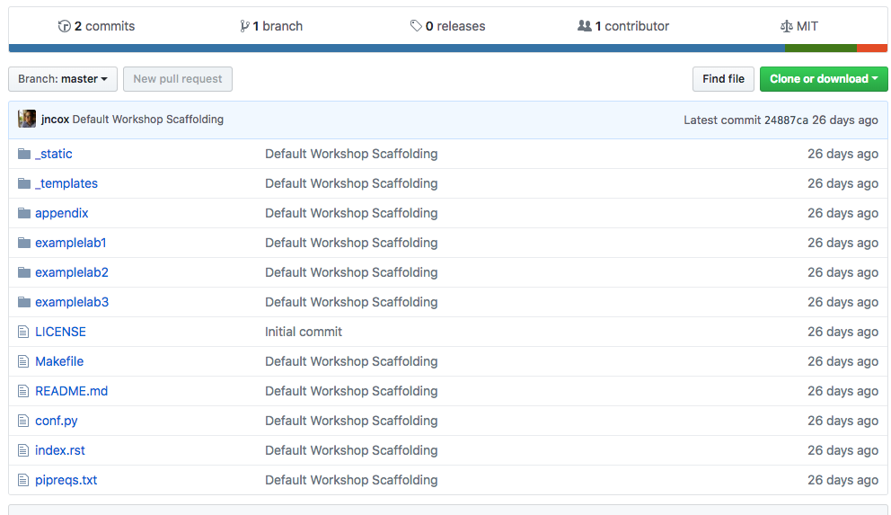

To get these templates onto our machine the **git** command will be used to clone the data into the directory created earlier (Documents/github/test).

Steps to be taken:

#. Open de commnad line/terminal

#. cd to the location where the created directory is

#. run the command **git clone https://github.com/nutanixworkshops/workshop-repo-template**

After this command (see the screenshot below) you will have the data local on the machine in a subdirectory in the directory you are in.

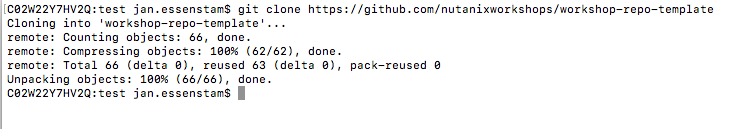

Copy the cloned *workshop-repo-template* to a new directory or rename it. By copying you will have the templates available all the time for new documents.

.. note:: If changes have happened, you can check that by repeating the first two steps and run the command **git pull https://github.com/nutanixworkshops/workshop-repo-template** to get the latest changes if there are any.

After you have created the directory in which you want to work/create the documentation and have copied the template files in, copy a file called .gitignore in the root of the working directory. This will make sure that not needed files are uploaded to the GitHub server. An example is .DS_Dstore or thumbs.ini. Download the file :download:`.gitignore file <../.gitignore>`. Change the downloaded **txt** file to .gitignore and place in the root of the project.

Start using Atom
++++++++++++++++

After the installation start Atom. After it has started it will show roughly like the below screen.

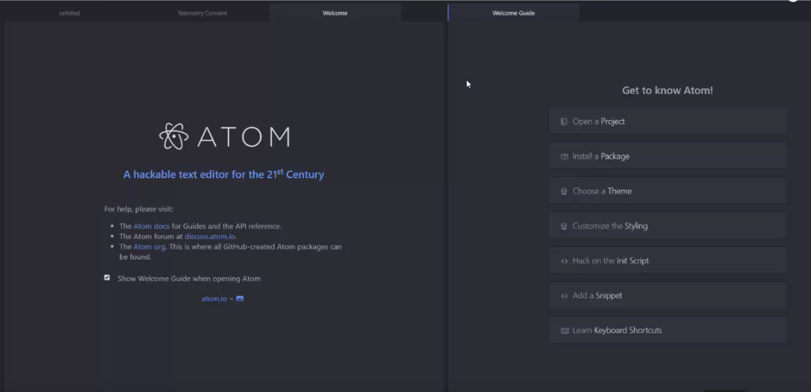

You can close the panes and select what you want to do with them in the future/next start.
To open the document, click on file -> Open and navigate to your directory where you have your index.rst file. Open this file and you should see a pane/tab with the example file.

Make the changes so it will show your documentation. To have a quick referencens document, use http://docutils.sourceforge.net/docs/user/rst/quickref.html as and example. Otherwise search google.com on ReStructuredTest reference.

Saving the documents
++++++++++++++++++++

After you have created your document and before you can build the cahnges into a HTML layout, you need to save the document. Saving the document makes it possible afterwards to Commit, Push and build the documentation.

Saving the documentation is very easy, just save in Atom as you are used to save documents as in Word or other tools you use. Click **File -> Save**, or the hot key to save the data.

(Optional) Build the data
+++++++++++++++++++++++++

Building data means that a tool will translate the create document (.rst file) into HTMl pages. To build the HTML pages the command **sphinx-build** will be run from the command line/terminal session. This means the sphinx packages have been installed as mentioned in pre-requirements part of this workshop.

Steps to take to get a build ready:

#. Open the command line/terminal session

#. Change to the root of the directory of the documentation you want to create. In my example Documents/test/test (I have copied the workshop-repo-template).

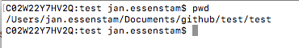

#. Run the **sphinx-build** command to create the HTML pages. The command is **sphinx-build . _build**. A small explenation:

* The **.** stands for the current directory, search for a rst file and follow the links in the file.

* **_build** stands for the output folder of the HTML pages.

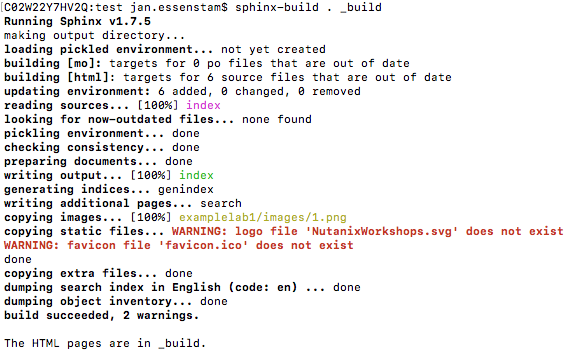

#. Test the layout in the browser

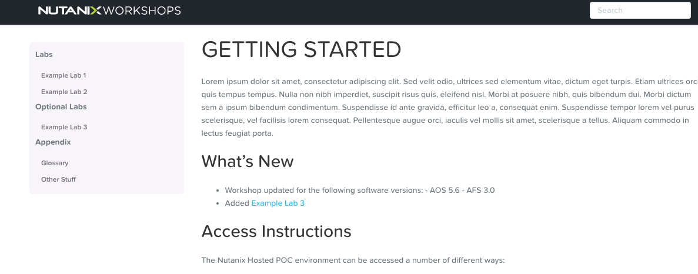

Commit the data
+++++++++++++++

After you have saved and the data loooks quite good, you have to commit the changes that have been made. To do this, select **Packages -> GitHub -> Toggle Git Tab** (or use the hotkeys).

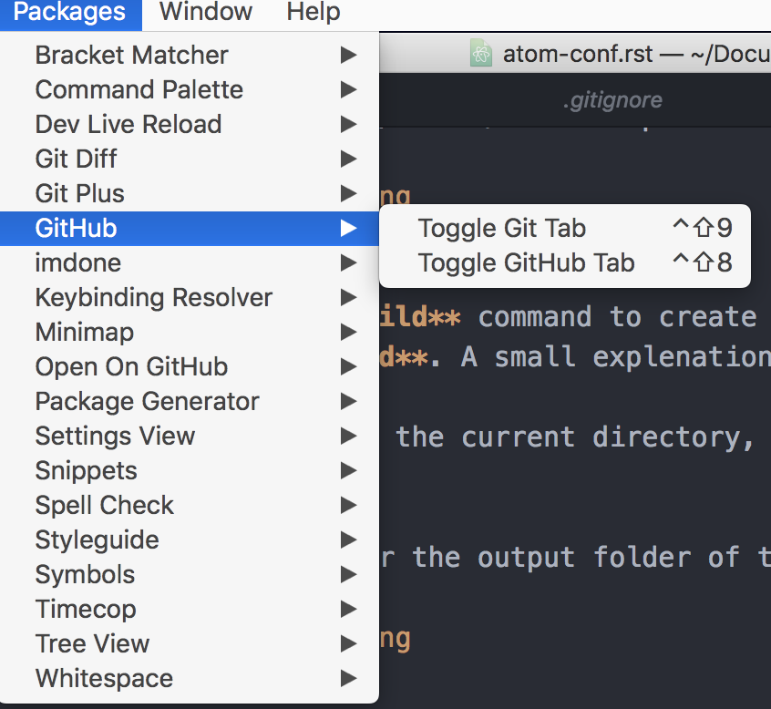

When the screen opens, on the lefthand side of the Atom screen you will find colorized line(s) with data. These lines are what will be done on the commit ("write") action local. It will also be the actions that will be produced in the location on GitHub.

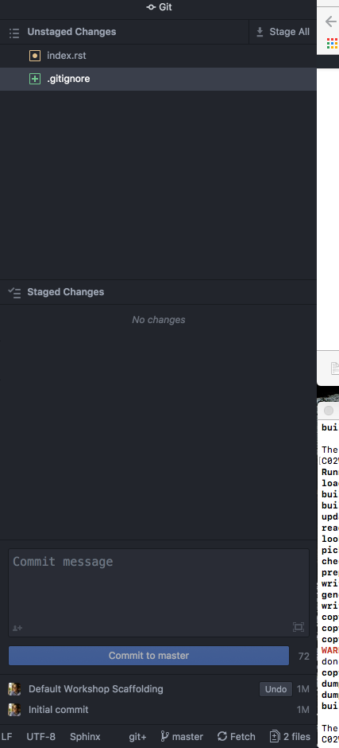

By clicking on the Stage All text (top rightcorner), all actions are to be commited. Now you can select the one you don't want, by selecting them and right-click and select **Discard Changes**.

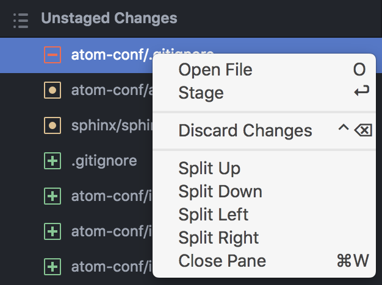

If you are interested in the changes, click on the file and you will see what will happen. Are all the changes ok, then provide a Commit message and click on the **Commit to master** button.

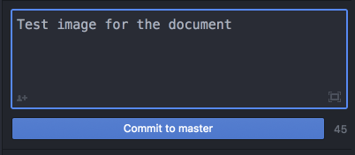

After this the status bar at the bottom of the git pane should show **Push 1**.

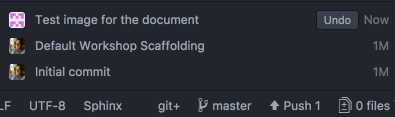

Now we are all set to push the data towards the GitHub personal part. Click on the **Push 1** button to upload the data.

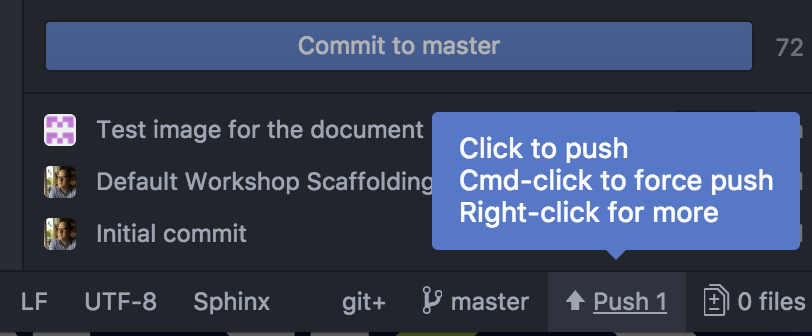
